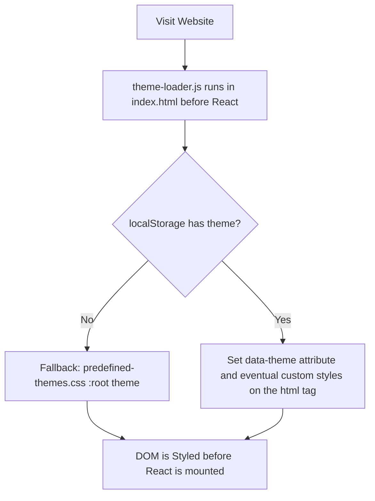

# react-vite-ts-template

This repository is a **template project** for quickly bootstrapping a React application using **TypeScript**, **Vite**, and **SWC**.

## Features

-   **Vite 7 + SWC** for fast builds and hot module replacement
-   **React 19** with **TypeScript** typings
-   Built-in **theme management** (persisted custom user-defined themes) and a fix for the [flash of unstyled content](https://en.wikipedia.org/wiki/Flash_of_unstyled_content) issue
-   Ready-to-package as a **Firefox extension (.xpi)**

## Getting Started

### 1. Clone the template

```bash
git clone https://github.com/AlfredoJSpera/react-vite-ts-template.git my-app
cd my-app
```

> [!TIP]
> Or click the "Use this template" button on the repository page on GitHub.

### 2. Install dependencies

```bash
npm install
```

### 3. Start the development server

```bash
npm run dev
```

This will launch Vite in development mode with hot reloading.

## Build

### Standard build

```bash
npm run build
```

Compiles the app into the `dist/` folder.

### Build & package as Firefox extension

```bash
npm run build:xpi
```

-   Runs the production build
-   Zips the contents of `dist/` into `extension.xpi`

> [!NOTE]
> The `public/manifest.json` can be edited as needed to create the extension.

## Using the app as a Firefox Extension

> [!NOTE]
> If you don't want or need to use the app as an extension:
>
> -   Delete the `src/hooks/useContentScriptMessage.ts` hook
> -   Delete the `src/components/DisplayH1sInPage.tsx` component
> -   Delete the `src/types/contentScriptTypes.ts` file
> -   Delete the `src/contentScript.ts` file
> -   Delete the `public/manifest.json` file
> -   Execute `npm remove @types/firefox-webext-browser`
> -   Delete all lines marked from `//! Browser Content Script Only` to `//! ---------------------` in `vite.config.ts`

### Content Script

The `useContentScriptMessage` hook sends and receives messages to and from the `src/contentScript.ts` file.
For an example of usage, see `src/components/DisplayH1sInPage.tsx`. For more information on content scripts, see [here](https://developer.mozilla.org/en-US/docs/Mozilla/Add-ons/WebExtensions/Content_scripts).

### Loading the app as a temporary extension

#### With the .xpi

1. Run `build:xpi` to obtain the `extension.xpi`
2. Open Firefox and navigate to:

    ```
    about:debugging#/runtime/this-firefox
    ```

3. Click **"Load Temporary Add-on"**
4. Select `extension.xpi`

#### With the /dist directory

1. Run `build` to create the `/dist` directory
2. Open Firefox and navigate to:

    ```
    about:debugging#/runtime/this-firefox
    ```

3. Click **"Load Temporary Add-on"**
4. Select any file in the `/dist` directory, for example `manifest.json`

## How to add a theme

-   Add the theme as CSS variables in `src/theme/predefined-themes.css`
-   Add the name of the new theme in the **`PREDEFINED_THEME_NAMES`** array in `src/theme/theme.ts`

## How to use the Theme Manager Hook

The `useTheme` hook should be called only once in the app, preferably in a component to switch the theme.
See `src/components/ThemeSwitcher.tsx` or `src/components/ThemeSwitcherWithoutCustom.tsx` for an example of usage.

You can:

-   Switch to another theme
-   Save/Edit/Delete custom themes (**optional**)

> [!NOTE]
> If you don't want or need custom theming, you should:
>
> -   Be sure to clear the localStorage for the webapp
> -   Delete the `src/hooks/useTheme.ts` hook
> -   Delete the `src/components/ThemeSwitcher.tsx` component
> -   Use (and rename if necessary) the `src/hooks/useThemeWithoutCustom.ts` hook
> -   Use (and rename if necessary) the `src/components/ThemeSwitcherWithoutCustom.tsx` component
> -   Delete all lines marked from `//! Custom Theme Only` to `//! ---------------------` in `public/theme-loader.js`

## How the Flash of Unstyled Content fix works



## License

This template is provided as-is under the [MIT license](LICENSE). Feel free to fork and customize it for your projects.
