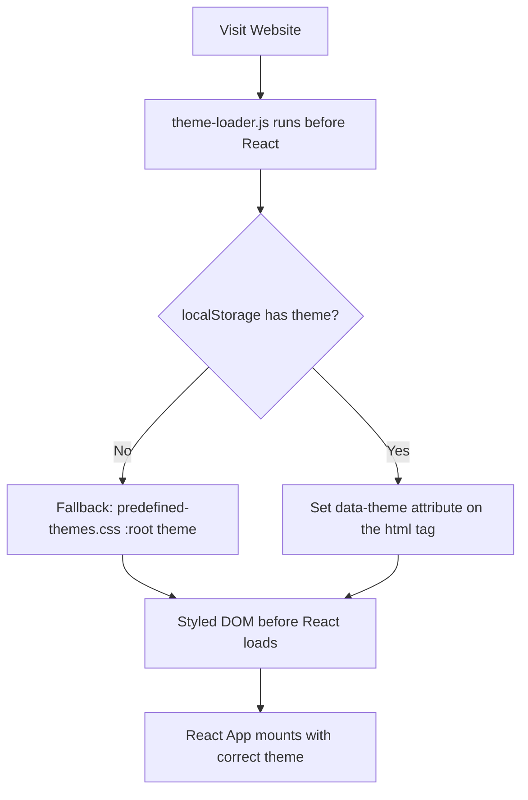

# react-vite-ts-template

This repository is a **template project** for quickly bootstrapping a React application using **TypeScript**, **Vite**, and **SWC**.

## Features

-   **Vite 7 + SWC** for fast builds and hot module replacement
-   **React 19** with **TypeScript** typings
-   Built-in **theme management** (persisted custom user-defined themes) and a fix for the [flash of unstyled content](https://en.wikipedia.org/wiki/Flash_of_unstyled_content) issue
-   Ready-to-package as a **Firefox extension (.xpi)**

## TODO

-   [x] Set up Vite
-   [x] Local Storage State manager
-   [x] Theme manager
-   [x] Flash of Unstyled Content fix
-   [x] Firefox-ready
-   [ ] Remove custom theme
-   [ ] Settings JSON downloader/importer

## Getting Started

### 1. Clone the template

```bash
git clone https://github.com/AlfredoJSpera/react-vite-ts-template.git my-app
cd my-app
```

> [!TIP]
> Or click the "Use this template" button on the repository page on GitHub.

### 2. Install dependencies

```bash
npm install
```

### 3. Start the development server

```bash
npm run dev
```

This will launch Vite in development mode with hot reloading.

## Build

### Standard build

```bash
npm run build
```

Compiles the app into the `dist/` folder.

### Build & package as Firefox extension

```bash
npm run build:xpi
```

-   Runs the production build
-   Zips the contents of `dist/` into `extension.xpi`

> [!NOTE]
> The `public/manifest.json` can be edited as needed to create the extension.

## Using as a Firefox Extension

### As a temporary extension

1. Download the packaged `extension.xpi`
2. Open Firefox and navigate to:

    ```
    about:debugging#/runtime/this-firefox
    ```

3. Click **"Load Temporary Add-on"**
4. Select `extension.xpi`

### As a fully installed extension

> [!WARNING]
> Currently WIP.

## Dependencies

-   [React 19](https://react.dev/)
-   [Vite 7](https://vitejs.dev/)
-   [TypeScript](https://www.typescriptlang.org/)
-   [SWC](https://swc.rs/) (via `@vitejs/plugin-react-swc`)

## How does the theme manager works



## License

This template is provided as-is under the [MIT license](LICENSE). Feel free to fork and customize it for your projects.
