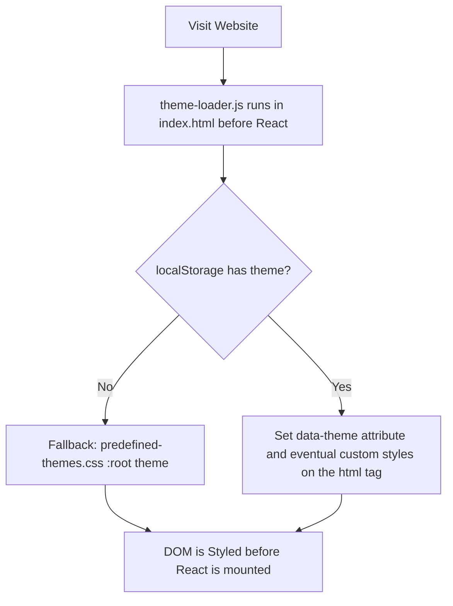

# react-vite-ts-template

This repository is a **template project** for quickly bootstrapping a **React** application using **TypeScript**, **Vite**, and **SWC**.

## Features

-   **[Vite](https://vite.dev/) + [SWC](https://swc.rs/)** for fast builds and hot module replacement
-   **[React](https://react.dev/)** with **[TypeScript](https://www.typescriptlang.org/)** typings
-   Built-in **theme management** (persisted custom user-defined themes) and a fix for the [flash of unstyled content](https://en.wikipedia.org/wiki/Flash_of_unstyled_content) issue
-   Ready-to-package as a **Firefox extension (.xpi)**

## Getting Started

### 1. Clone the template

```bash
git clone https://github.com/AlfredoJSpera/react-vite-ts-template.git my-app
cd my-app
```

> [!TIP]
> Or click the "Use this template" button on the repository page on GitHub.

### 2. Install dependencies

```bash
npm install
```

### 3. Start the development server

```bash
npm run dev
```

This will launch Vite in development mode with hot reloading.

## Build

### Standard build

```bash
npm run build
```

Compiles the app into the `dist/` directory.

### Build and package as .xpi

A `.xpi` file is an archive used for packaging Firefox applications.

```bash
npm run build:xpi
```

-   Runs the production build
-   Zips the contents of `dist/` into `extension.xpi`

## Using the app as a Firefox extension

> [!NOTE]
> If you don't want or need to use the app as an extension:
>
> -   Delete the `src/components/DisplayH1sInPage.tsx` component
> -   Delete the `src/utils/sendContentScriptMessage.ts` file
> -   Delete the `src/types/contentScriptTypes.ts` file
> -   Delete the `src/contentScript.ts` file
> -   Delete the `public/manifest.json` file
> -   Execute `npm remove @types/firefox-webext-browser`
> -   Delete all lines marked from `//! Browser Content Script Only` to `//! ---------------------` in `vite.config.ts`

### Extension manifest

The manifest file `public/manifest.json` can be edited as needed to create the extension.

> [!NOTE]
> For more information on manifest.json see [here](https://developer.mozilla.org/en-US/docs/Mozilla/Add-ons/WebExtensions/manifest.json).

### Content script

The `sendContentScriptMessage` function sends and receives messages to and from the `src/contentScript.ts` file. For an example of usage, see `src/components/DisplayH1InPage.tsx`.

> [!NOTE]
> For more information on content scripts, see [here](https://developer.mozilla.org/en-US/docs/Mozilla/Add-ons/WebExtensions/Content_scripts).

### Loading the app as a temporary extension

#### Using the dist/ directory

1. Build the project like mentioned [above](#standard-build) to create the `/dist` directory
2. Open Firefox and navigate to:

    ```
    about:debugging#/runtime/this-firefox
    ```

3. Click **"Load Temporary Add-on"**
4. Select any file in the `/dist` directory, for example `manifest.json`

#### Using the .xpi file

1. Obtain the `extension.xpi` like mentioned [above](#build-and-package-as-xpi)
2. Open Firefox and navigate to:

    ```
    about:debugging#/runtime/this-firefox
    ```

3. Click **"Load Temporary Add-on"**
4. Select `extension.xpi`

## Themes

### How to use the theme manager

### How to add themes

#### Predefined themes

-   Add the CSS variables that you intend to use for a theme in `src/theme/predefined-themes.css`
-   Add the name of the new theme in the **`PREDEFINED_THEME_NAMES`** array in `src/theme/themeConfig.ts`

#### User-defined themes

See `src/components/ThemeSwitcher.tsx` to see an example on how to use the `useThemeContext` hook.

### How to use ONLY predefined themes

Run the `set_without_custom_theme.sh` executable.

### How the Flash of Unstyled Content fix works



## License

This template is provided as-is under the [MIT license](LICENSE). Feel free to fork and customize it for your projects.
